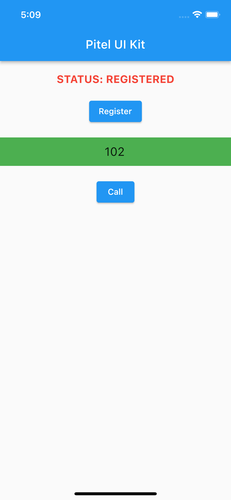
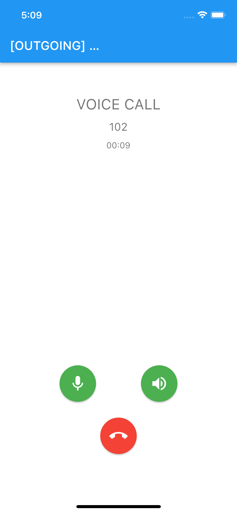

# plugin_pitel
### Tài liệu Tích hợp Voip vào dự án của bạn

[](https://documents.tel4vn.com/)

plugin_pitel là package hỗ trợ đàm thoại voip vào dự án Flutter của bạn.✨ 

## Demo


## Installation
1. Tạo 1 folder lưu trữ package (vì package này là private, sẽ hỗ trợ link github  sau)
```
├── global folder
│   ├── pitel_sdk      // Folder chứa plugin_pitel
│   ├── pitel_ui_kit   //  Project của bạn
```

2. Trong file ```pubspec.yaml``` project của bạn (trong ví dụ này là  ```pitel_ui_kit```)
```
dependencies:
  flutter:
    sdk: flutter
    
    plugin_pitel:                   // Thêm package plugin_pitel
        path: ../pitel_sdk   
    
```
3. Thêm Pitel service 
Tạo 1 folder ```services``` chức các file để handle các sự kiện gọi từ  package  ```plugin_pitel```
```
├── lib
│   ├── services     // Folder services
│   │   ├──  pitel_service_interface.dart
│   │   ├──  pitel_service.dart
│   │   ├──  sip_info_data.dart
```
Download các file trong folder services ở đây
Trong file ```sip_info_data.dart``` thay thế apiBaseUrl thành domain của bạn.
```dart
const String apiBaseUrl = 'your_api_domain';
```

4. Các tính năng chính
> **Lưu ý:** trong Project demo ```go_router```,.. để quản lý router,..
=> Hoàn toàn có thể sử dụng giải pháp khác để  thay thế  (tuỳ  vào droject của bạn)

- Register Extension
- Gọi điện 
- Gác máy
- Bật/ Tắt mic
- Bật/ Tắt loa ngoài

## Usage
 Bắt đầu đăng ký Extension (thiết bị đầy cuối) bằng tài khoản tel4vn đã cung cấp ví dụ: 101, 102,…
> **Lưu ý:** ```pitel_ui_kit``` là đường dẫn import project của bạn.

```dart
import 'package:pitel_ui_kit/services/sip_info_data.dart';
```

Tạo 1 button để Bắt đầu đăng ký Extenstion
```dart
ElevatedButton(
        onPressed: () {
          final sipInfo = SipInfoData.fromJson({
            "authPass": "DevTest#2023@!",
            "registerServer": "dev-test.tel4vn.com",
            "outboundServer": "pbx-mobile.tel4vn.com:50061",
            "userID": 101,
            "authID": 101,
            "accountName": "101",
            "displayName": "101@dev-test.tel4vn.com",
            "dialPlan": null,
            "randomPort": null,
            "voicemail": null,
            "wssUrl": "wss://wss-mobile.tel4vn.com:7444",
            "userName": "user1@dev-test.tel4vn.com",
            "apiDomain": "https://pbx-mobile.tel4vn.com"
          });

          final pitelClient = PitelServiceImpl();
          pitelClient.setExtensionInfo(sipInfo);
        },
        child: const Text("Register"),),
```

## Example
- Ở màn hình ```home_screen.dart```
```dart
import 'package:flutter/material.dart';
import 'package:go_router/go_router.dart';
import 'package:pitel_ui_kit/routing/app_router.dart';
import 'package:pitel_ui_kit/services/pitel_service.dart';
import 'package:pitel_ui_kit/services/sip_info_data.dart';
import 'package:plugin_pitel/component/pitel_call_state.dart';
import 'package:plugin_pitel/component/sip_pitel_helper_listener.dart';
import 'package:plugin_pitel/pitel_sdk/pitel_call.dart';
import 'package:plugin_pitel/pitel_sdk/pitel_client.dart';
import 'package:plugin_pitel/sip/sip_ua.dart';
import 'package:shared_preferences/shared_preferences.dart';

class HomeScreen extends StatefulWidget {
  final PitelCall _pitelCall = PitelClient.getInstance().pitelCall;
  HomeScreen({Key? key}) : super(key: key);

  @override
  State<HomeScreen> createState() => _MyHomeScreen();
}

class _MyHomeScreen extends State<HomeScreen>
    implements SipPitelHelperListener {
  late String _dest;
  PitelCall get pitelCall => widget._pitelCall;
  final TextEditingController _textController = TextEditingController();
  late SharedPreferences _preferences;

  String receivedMsg = 'UNREGISTER';
  PitelClient pitelClient = PitelClient.getInstance();
  String state = '';

  // INIT: Initialize state
  @override
  initState() {
    super.initState();
    state = pitelCall.getRegisterState();
    receivedMsg = 'UNREGISTER';
    _bindEventListeners();
    _loadSettings();
  }

  @override
  void deactivate() {
    super.deactivate();
    _removeEventListeners();
  }

  // INIT: Load default settings
  void _loadSettings() async {
    _preferences = await SharedPreferences.getInstance();
    _dest = _preferences.getString('dest') ?? '';
    _textController.text = _dest;
  }

  void _bindEventListeners() {
    pitelCall.addListener(this);
  }

  void _removeEventListeners() {
    pitelCall.removeListener(this);
  }

  // HANDLE: handle message if register status change
  @override
  void onNewMessage(PitelSIPMessageRequest msg) {
    var msgBody = msg.request.body as String;
    setState(() {
      receivedMsg = msgBody;
    });
  }

  @override
  void callStateChanged(String callId, PitelCallState state) {}

  @override
  void transportStateChanged(PitelTransportState state) {}

  @override
  void onCallReceived(String callId) {
    pitelCall.setCallCurrent(callId);
    context.pushNamed(AppRoute.callScreen.name);
  }

  @override
  void onCallInitiated(String callId) {
    pitelCall.setCallCurrent(callId);
    context.pushNamed(AppRoute.callScreen.name);
  }

  // ACTION: call device if register success
  // Flow: Register (with sipInfoData) -> Register success REGISTERED -> Start Call
  void _handleCall(BuildContext context, [bool voiceonly = false]) {
    var dest = _textController.text;
    if (dest.isEmpty) {
      showDialog(
        context: context,
        barrierDismissible: true,
        builder: (BuildContext context) {
          return const AlertDialog(
            title: Text('Target is empty.'),
            content: Text('Please enter a SIP URI or username!'),
          );
        },
      );
    } else {
      pitelClient.call(dest, voiceonly).then((value) =>
          value.fold((succ) => {}, (err) => {receivedMsg = err.toString()}));
      _preferences.setString('dest', dest);
    }
  }

  void goBack() {
    pitelClient.release();
    context.go('/');
  }

  @override
  Widget build(BuildContext context) {
    return Scaffold(
      appBar: AppBar(
        title: const Text("Pitel UI Kit"),
        centerTitle: true,
      ),
      body: Column(crossAxisAlignment: CrossAxisAlignment.center, children: [
        Container(
            padding: const EdgeInsets.all(20),
            width: 360,
            child: Text(
              'STATUS: $receivedMsg',
              textAlign: TextAlign.center,
              style: const TextStyle(
                  fontSize: 18, fontWeight: FontWeight.bold, color: Colors.red),
            )),
        ElevatedButton(
          onPressed: () {
            // SIP INFO DATA: input Sip info config data
            final sipInfo = SipInfoData.fromJson({
              "authPass": "DevTest#2023@!",
              "registerServer": "dev-test.tel4vn.com",
              "outboundServer": "pbx-mobile.tel4vn.com:50061",
              "userID": 101,
              "authID": 101,
              "accountName": "101",
              "displayName": "101@dev-test.tel4vn.com",
              "dialPlan": null,
              "randomPort": null,
              "voicemail": null,
              "wssUrl": "wss://wss-mobile.tel4vn.com:7444",
              "userName": "user1@dev-test.tel4vn.com",
              "apiDomain": "https://pbx-mobile.tel4vn.com"
            });

            final pitelClient = PitelServiceImpl();
            pitelClient.setExtensionInfo(sipInfo);
          },
          child: const Text("Register"),
        ),
        const SizedBox(height: 20),
        Container(
          color: Colors.green,
          child: TextField(
            keyboardType: TextInputType.number,
            style: const TextStyle(fontSize: 20),
            textAlign: TextAlign.center,
            decoration: const InputDecoration(
                border: InputBorder.none,
                hintText: "Input Phone number",
                hintStyle: TextStyle(fontSize: 18)),
            controller: _textController,
            showCursor: true,
            autofocus: true,
          ),
        ),
        const SizedBox(height: 20),
        receivedMsg == "REGISTERED"
            ? ElevatedButton(
                onPressed: () => _handleCall(context, true),
                child: const Text("Call"))
            : const SizedBox.shrink(),
      ]),
    );
  }

  // STATUS: check register status
  @override
  void registrationStateChanged(PitelRegistrationState state) {
    switch (state.state) {
      case PitelRegistrationStateEnum.REGISTRATION_FAILED:
        goBack();
        break;
      case PitelRegistrationStateEnum.NONE:
      case PitelRegistrationStateEnum.UNREGISTERED:
      case PitelRegistrationStateEnum.REGISTERED:
        setState(() {
          receivedMsg = 'REGISTERED';
        });
        break;
    }
  }
}

```
- Ở màn hình ```call_screen.dart```
```dart
import 'dart:async';
import 'package:flutter/material.dart';
import 'package:go_router/go_router.dart';
import 'package:pitel_ui_kit/common_widgets/action_button.dart';
import 'package:plugin_pitel/component/pitel_call_state.dart';
import 'package:plugin_pitel/component/pitel_rtc_video_view.dart';
import 'package:plugin_pitel/component/sip_pitel_helper_listener.dart';
import 'package:plugin_pitel/pitel_sdk/pitel_call.dart';
import 'package:plugin_pitel/pitel_sdk/pitel_client.dart';
import 'package:plugin_pitel/sip/sip_ua.dart';

class CallScreenWidget extends StatefulWidget {
  CallScreenWidget({Key? key, this.receivedBackground = false})
      : super(key: key);
  final PitelCall _pitelCall = PitelClient.getInstance().pitelCall;
  final bool receivedBackground;

  @override
  State<CallScreenWidget> createState() => _MyCallScreenWidget();
}

class _MyCallScreenWidget extends State<CallScreenWidget>
    implements SipPitelHelperListener {
  PitelCall get pitelCall => widget._pitelCall;

  String _timeLabel = '00:00';
  late Timer _timer;
  bool _speakerOn = false;
  PitelCallStateEnum _state = PitelCallStateEnum.NONE;
  bool calling = false;
  bool _isBacked = false;
  bool get voiceonly => pitelCall.isVoiceOnly();
  String? get direction => pitelCall.direction;

  @override
  initState() {
    super.initState();
    pitelCall.addListener(this);
    if (voiceonly) {
      _initRenderers();
    }
    _startTimer();
  }

  // Deactive & Dispose when call end
  @override
  deactivate() {
    super.deactivate();
    _handleHangup();
    pitelCall.removeListener(this);
    _disposeRenderers();
  }

  // Start timer to calculate time of call
  void _startTimer() {
    _timer = Timer.periodic(const Duration(seconds: 1), (Timer timer) {
      final duration = Duration(seconds: timer.tick);
      if (mounted) {
        setState(() {
          _timeLabel = [duration.inMinutes, duration.inSeconds]
              .map((seg) => seg.remainder(60).toString().padLeft(2, '0'))
              .join(':');
        });
      } else {
        _timer.cancel();
      }
    });
  }

  // INIT: Initialize Pitel
  void _initRenderers() async {
    if (!voiceonly) {
      await pitelCall.initializeLocal();
      await pitelCall.initializeRemote();
    }
  }

  // Dispose pitelcall
  void _disposeRenderers() {
    pitelCall.disposeLocalRenderer();
    pitelCall.disposeRemoteRenderer();
  }

  // STATUS: Handle call state
  @override
  void callStateChanged(String callId, PitelCallState callState) {
    setState(() {
      _state = callState.state;
    });
    switch (callState.state) {
      case PitelCallStateEnum.HOLD:
      case PitelCallStateEnum.UNHOLD:
        break;
      case PitelCallStateEnum.MUTED:
      case PitelCallStateEnum.UNMUTED:
        break;
      case PitelCallStateEnum.STREAM:
        break;
      case PitelCallStateEnum.ENDED:
      case PitelCallStateEnum.FAILED:
        _backToDialPad();
        break;
      case PitelCallStateEnum.CONNECTING:
      case PitelCallStateEnum.PROGRESS:
      case PitelCallStateEnum.ACCEPTED:
      case PitelCallStateEnum.CONFIRMED:
      case PitelCallStateEnum.NONE:
      case PitelCallStateEnum.CALL_INITIATION:
      case PitelCallStateEnum.REFER:
        break;
    }
  }

  // Setup initialize listener
  @override
  void onNewMessage(PitelSIPMessageRequest msg) {}

  @override
  void registrationStateChanged(PitelRegistrationState state) {}

  @override
  void transportStateChanged(PitelTransportState state) {}

  @override
  void onCallReceived(String callId) {
    pitelCall.setCallCurrent(callId);
    setState(() {});
  }

  @override
  void onCallInitiated(String callId) {}

  // Back to Home screen
  void _backToDialPad() {
    if (mounted && !_isBacked) {
      _isBacked = true;
      context.pop();
    }
  }

  // Handle hangup and reset timer
  void _handleHangup() {
    pitelCall.hangup();
    if (_timer.isActive) {
      _timer.cancel();
    }
  }

  // Handle accept call
  void _handleAccept() {
    pitelCall.answer();
  }

  // Turn on/off speaker
  void _toggleSpeaker() {
    if (pitelCall.localStream != null) {
      _speakerOn = !_speakerOn;
      pitelCall.enableSpeakerphone(_speakerOn);
    }
  }

  Widget _buildActionButtons() {
    var hangupBtn = ActionButton(
      title: "hangup",
      onPressed: () {
        _handleHangup();
        _backToDialPad();
      },
      icon: Icons.call_end,
      fillColor: Colors.red,
    );

    var hangupBtnInactive = ActionButton(
      title: "hangup",
      onPressed: () {},
      icon: Icons.call_end,
      fillColor: Colors.grey,
    );

    var basicActions = <Widget>[];
    var advanceActions = <Widget>[];
    switch (_state) {
      case PitelCallStateEnum.NONE:
      case PitelCallStateEnum.PROGRESS:
        if (direction == 'INCOMING') {
          basicActions.add(ActionButton(
            title: "Accept",
            fillColor: Colors.green,
            icon: Icons.phone,
            onPressed: () => _handleAccept(),
          ));
          basicActions.add(hangupBtn);
        } else {
          basicActions.add(hangupBtn);
        }
        break;
      case PitelCallStateEnum.CONNECTING:
        break;
      case PitelCallStateEnum.MUTED:
      case PitelCallStateEnum.UNMUTED:
      case PitelCallStateEnum.ACCEPTED:
      case PitelCallStateEnum.CONFIRMED:
        {
          advanceActions.add(ActionButton(
            title: pitelCall.audioMuted ? 'unmute' : 'mute',
            icon: pitelCall.audioMuted ? Icons.mic_off : Icons.mic,
            checked: pitelCall.audioMuted,
            fillColor: Colors.green,
            onPressed: () => pitelCall.mute(),
          ));

          if (voiceonly) {
            advanceActions.add(ActionButton(
              title: _speakerOn ? 'speaker off' : 'speaker on',
              icon: _speakerOn ? Icons.volume_off : Icons.volume_up,
              fillColor: Colors.green,
              checked: _speakerOn,
              onPressed: () => _toggleSpeaker(),
            ));
          }

          basicActions.add(hangupBtn);
        }
        break;
      case PitelCallStateEnum.FAILED:
      case PitelCallStateEnum.ENDED:
        basicActions.add(hangupBtnInactive);
        break;
      default:
        break;
    }

    var actionWidgets = <Widget>[];

    if (advanceActions.isNotEmpty) {
      actionWidgets.add(Padding(
          padding: const EdgeInsets.all(3),
          child: Row(
              mainAxisAlignment: MainAxisAlignment.spaceEvenly,
              children: advanceActions)));
    }

    actionWidgets.add(Padding(
        padding: const EdgeInsets.all(3),
        child: Row(
            mainAxisAlignment: MainAxisAlignment.spaceEvenly,
            children: basicActions)));

    return Column(
        crossAxisAlignment: CrossAxisAlignment.end,
        mainAxisAlignment: MainAxisAlignment.end,
        children: actionWidgets);
  }

  Widget _buildContent() {
    var stackWidgets = <Widget>[];

    if (!voiceonly &&
        pitelCall.remoteStream != null &&
        pitelCall.remoteRenderer != null) {
      stackWidgets.add(Center(
        child: PitelRTCVideoView(pitelCall.remoteRenderer!),
      ));
    }

    if (!voiceonly &&
        pitelCall.localStream != null &&
        pitelCall.localRenderer != null) {
      stackWidgets.add(Container(
        alignment: Alignment.topRight,
        child: AnimatedContainer(
          height: 0,
          width: 0,
          alignment: Alignment.topRight,
          duration: const Duration(milliseconds: 300),
          child: PitelRTCVideoView(pitelCall.localRenderer!),
        ),
      ));
    }

    stackWidgets.addAll([
      Positioned(
        top: voiceonly ? 48 : 6,
        left: 0,
        right: 0,
        child: Center(
            child: Column(
          crossAxisAlignment: CrossAxisAlignment.center,
          mainAxisAlignment: MainAxisAlignment.center,
          children: <Widget>[
            const Center(
                child: Padding(
                    padding: EdgeInsets.all(6),
                    child: Text(
                      'VOICE CALL',
                      style: TextStyle(fontSize: 24, color: Colors.black54),
                    ))),
            Center(
                child: Padding(
                    padding: const EdgeInsets.all(6),
                    child: Text(
                      '${pitelCall.remoteIdentity}',
                      style:
                          const TextStyle(fontSize: 18, color: Colors.black54),
                    ))),
            Center(
                child: Padding(
                    padding: const EdgeInsets.all(6),
                    child: Text(_timeLabel,
                        style: const TextStyle(
                            fontSize: 14, color: Colors.black54))))
          ],
        )),
      ),
    ]);

    return Stack(
      children: stackWidgets,
    );
  }

  @override
  Widget build(BuildContext context) {
    return Scaffold(
      backgroundColor: Colors.white,
      appBar: AppBar(
        automaticallyImplyLeading: false,
        title: Text('[$direction] $_state'),
        centerTitle: true,
      ),
      body: Container(
        child: pitelCall.isConnected && pitelCall.isHaveCall
            ? _buildContent()
            : const Center(
                child: CircularProgressIndicator(),
              ),
      ),
      floatingActionButtonLocation: FloatingActionButtonLocation.centerFloat,
      floatingActionButton: pitelCall.isConnected && pitelCall.isHaveCall
          ? Padding(
              padding: const EdgeInsets.fromLTRB(0.0, 0.0, 0.0, 24.0),
              child: SizedBox(
                width: 320,
                child: _buildActionButtons(),
              ),
            )
          : const SizedBox(),
    );
  }
}
```

## Test
Sử dụng tryit để thực hiện đàm thoại
Link: https://tryit.jssip.net/
Setting: 
1. Try cập vào link trên
2. Nhập số extension: ví dụ 102
3. Chọn icon Setting góc phải
4. Nhập các thông tin cần thiết

5. Save
6. Click icon ->

## License
Copyright by Tel4vn

